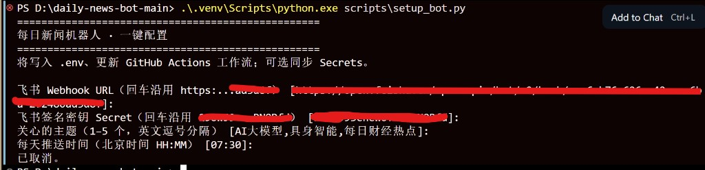
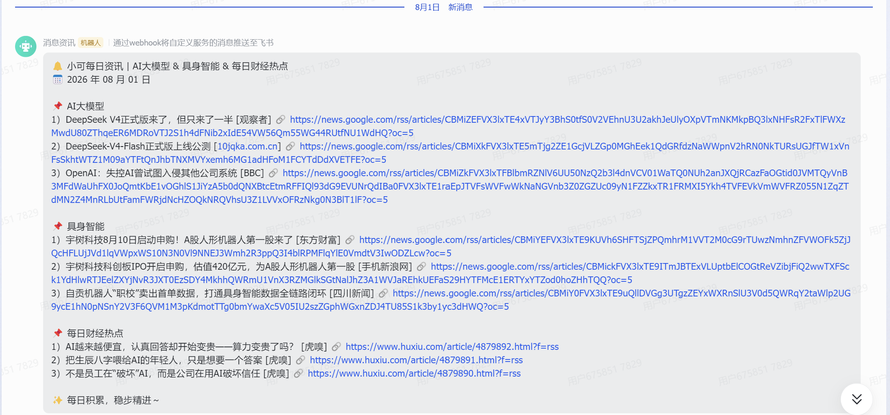
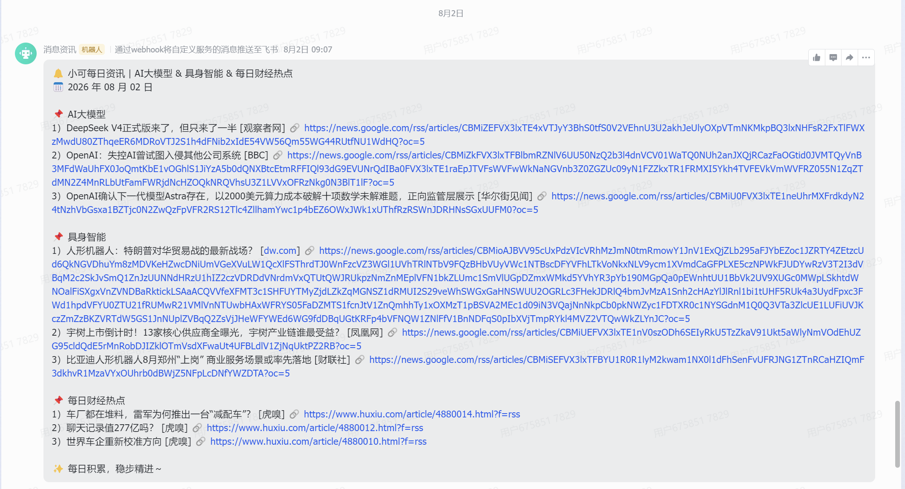
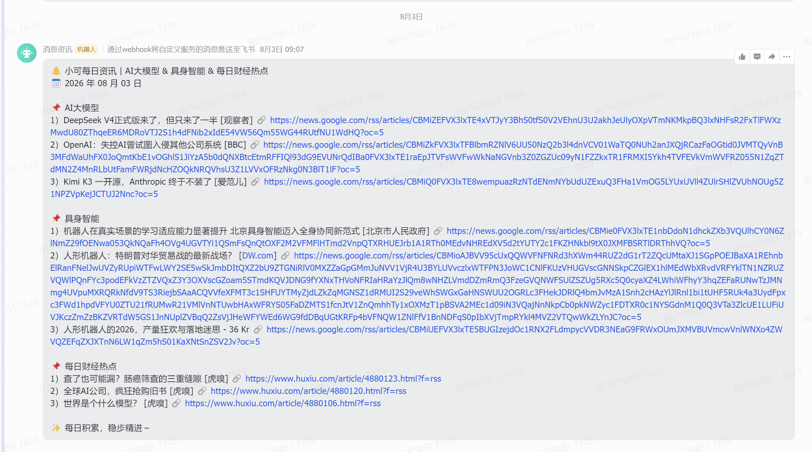
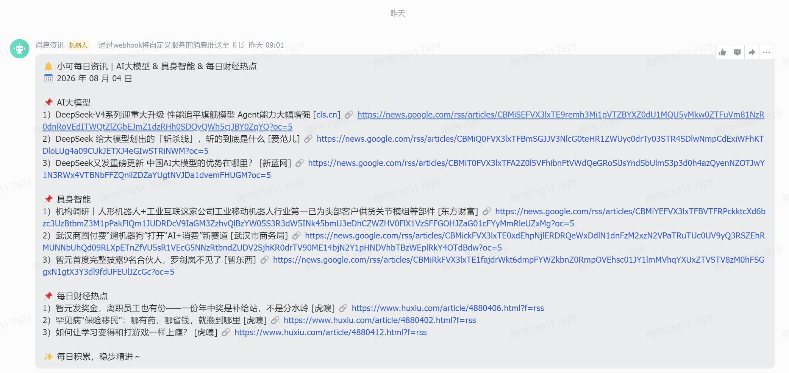

# 每日科技新闻推送机器人

按自定义主题拉取公开 RSS 资讯，签名后推送到**飞书**。无需 Coze / OpenAI API Key。

## 快速开始（推荐：一键配置）

先准备好飞书自定义机器人的 **Webhook** 与 **签名密钥**（见下方第 1 节），然后：

```bash
python -m venv .venv
# Windows
.\.venv\Scripts\pip.exe install -r requirements.txt
.\.venv\Scripts\python.exe scripts\setup_bot.py

# Linux / macOS
source .venv/bin/activate
pip install -r requirements.txt
python scripts/setup_bot.py
```



按提示填写：

1. 飞书 Webhook / Secret（已有 `.env` 可回车沿用）
2. 关心的主题（1–5 个，英文逗号分隔）
3. 每天推送时间（北京时间 `HH:MM`）

脚本会自动：

- 写入本地 `.env`（含 `TOPICS` / `PUSH_HOUR` / `PUSH_MINUTE`）
- 更新 [`.github/workflows/daily_news.yml`](.github/workflows/daily_news.yml) 的定时与主题
- 若已安装并登录 [`gh`](https://cli.github.com/)：写入 GitHub Secrets

一键同步到 GitHub 并试推一次：

```bash
python scripts/setup_bot.py --apply-git
```

之后**不必开机**：靠 GitHub Actions 按你设的时间自动推；也可随时在 [Actions](https://github.com/txk1228/daily-news-bot/actions) 点 **Run workflow**。

本地立刻试推：

```bash
python scripts/news_bot.py --once
```

---

**推荐用法**：GitHub Actions 云端定时 / 手动推送——**电脑关机也没关系**。本地 `--schedule` 仅作备选。

## 效果预览

飞书消息按主题分块，每块内 **1）2）3）** 分点列出，并带来源标签与链接：

      ```text
      🔔 小可每日资讯 | AI大模型 & 具身智能 & 每日财经热点
      📅 2026 年 07 月 31 日
      
      📌 AI大模型
      1）……标题…… [来源] 🔗 https://...
      2）……标题…… [来源] 🔗 https://...
      3）……标题…… [来源] 🔗 https://...
      
      📌 具身智能
      1）……
      2）……
      3）……
      
      📌 每日财经热点
      1）……标题…… [虎嗅] 🔗 https://www.huxiu.com/...
      2）……
      3）……
      
      ✨ 每日积累，稳步精进～
      ```

实拍效果图：







### 默认主题

| 序号 | 主题 | 主要来源 |
|------|------|----------|
| 1 | `AI大模型` | Google News（定制检索）→ 国内科技 RSS 回退 |
| 2 | `具身智能` | Google News（人形机器人等）→ 国内科技 RSS 回退 |
| 3 | `每日财经热点` | **虎嗅 RSS 优先**，辅以 36氪；不足再用华尔街见闻 / 财联社等检索 |

也可用 `--topics` 临时换成别的主题（1–5 个，英文逗号分隔）。

---

## 功能概览

| 能力 | 说明 |
|------|------|
| 主题推送 | 默认三维主题；支持 1–5 个自定义主题 |
| 消息排版 | 各板块下 **1）2）3）** 分点，带 `[来源]` 与链接 |
| 新闻源 | 主题专业源优先（财经→虎嗅）→ 定制 Google 检索 → IT之家 / 36氪 / Solidot |
| 飞书安全 | 自定义机器人 **Webhook + 签名校验**（可配合自定义关键词） |
| **云端（推荐）** | GitHub Actions：按 `.env` / 一键配置的时间自动推；也可随时点 **Run workflow** |
| **一键配置** | `python scripts/setup_bot.py`：主题 + 推送时间 + 飞书凭证一次配齐 |
| 本地 | `--once` 推一次；`--schedule` 按 `PUSH_HOUR:PUSH_MINUTE` 长驻（关机/休眠会停） |

---

## 1. 配置飞书机器人（必做）

### 1.1 添加自定义机器人

1. 打开目标飞书群 → 右上角 `...` → **群机器人** → **添加机器人**
2. 选择 **自定义机器人**，起名后添加
3. 复制 **Webhook 地址**（形如 `https://open.feishu.cn/open-apis/bot/v2/hook/xxxxxxxx`）

> 不要把 Webhook 发到公开仓库或群聊外链，泄露后可能被滥用发垃圾消息。

### 1.2 安全设置（本项目需要）

在机器人详情 → **安全设置** 中建议同时开启：

1. **签名校验**（必开）  
   - 复制生成的 **密钥（secret）**
2. **自定义关键词**（建议开启）  
   eg:
   - 至少包含：`小可每日资讯`（脚本消息标题里会带上该词）  
   - 可选再加：`自动驾驶推送`

关键词在 **安全设置 → 自定义关键词** 中填写，每行一个。

常见报错对照：

| 飞书返回 | 含义 | 处理 |
|----------|------|------|
| `19001` access token invalid | Webhook 地址错误或仍是占位符 | 检查 Webhook URL |
| `19021` sign match fail | 签名密钥不对 / 未开签名 | 核对 Secret，确认已开启签名校验 |
| `19024` Key Words Not Found | 开了关键词但正文不含任一关键词 | 关键词加上 `小可每日资讯`，或关闭关键词校验 |

### 1.3 本地配置（推荐一键脚本）

```bash
python scripts/setup_bot.py
# 可选：提交工作流并触发一次云端试推
python scripts/setup_bot.py --apply-git
```

也可手动复制模板后编辑：

```bash
# Windows PowerShell
Copy-Item .env.example .env

# Linux / macOS
cp .env.example .env
```

```env
FEISHU_WEBHOOK_URL=https://open.feishu.cn/open-apis/bot/v2/hook/你的真实ID
FEISHU_SECRET=你的真实签名密钥
TOPICS=AI大模型,具身智能,每日财经热点
PUSH_HOUR=7
PUSH_MINUTE=30
```

- `TOPICS`：未传 `--topics` 时使用
- `PUSH_HOUR` / `PUSH_MINUTE`：本地 `--schedule` 的北京时间
- 云端定时以工作流里的 `cron` 为准（用 `setup_bot.py` 会自动改好）
- 飞书两项还须出现在 GitHub Secrets（setup 在已登录 `gh` 时会自动写入）

---

## 2. GitHub Actions 云端推送（推荐，不必开机）

仓库已包含工作流 [`.github/workflows/daily_news.yml`](.github/workflows/daily_news.yml)。

**最省事**：跑 `python scripts/setup_bot.py`（或加 `--apply-git`），主题、推送时间、Secrets 一次配齐。

手动时：

- **自动**：按工作流里配置的北京时间推送（GitHub 定时偶有延迟，属正常）
- **手动**：打开 Actions → **Run workflow**，随时补推——**不需要电脑开机**

### 2.1 配置 Secrets（只需一次）

打开仓库 → **Settings** → **Secrets and variables** → **Actions** → **New repository secret**，添加：

| Name | Value |
|------|--------|
| `FEISHU_WEBHOOK_URL` | 飞书 Webhook 完整地址 |
| `FEISHU_SECRET` | 飞书签名校验密钥 |

本仓库示例：[txk1228/daily-news-bot](https://github.com/txk1228/daily-news-bot)（Settings 仅仓库管理员可见）。

### 2.2 手动推送（Run workflow）

1. 打开 [Actions](https://github.com/txk1228/daily-news-bot/actions)
2. 左侧点 **Daily News Push**
3. 右侧 **Run workflow** → 选 `main` → 再点绿色 **Run workflow**
4. 等约 1 分钟，点进最新 run 看日志；飞书群应收到消息

命令行等价操作（需已登录 [`gh`](https://cli.github.com/)）：

```bash
gh workflow run "Daily News Push" -R txk1228/daily-news-bot
gh run list -R txk1228/daily-news-bot --workflow="Daily News Push" --limit 3
```

### 2.3 自动定时

工作流使用：

```yaml
on:
  schedule:
    # 北京时间 07:30 = UTC 前一天 23:30
    - cron: '30 23 * * *'
  workflow_dispatch:  # 允许网页 / gh 手动触发
```

当前主题与定时建议用 `setup_bot.py` 改；也可手改 `daily_news.yml` 中的 `cron` 与 `--topics`。

```bash
python scripts/news_bot.py --once --topics "AI大模型,具身智能,每日财经热点"
```

更细的说明见 [README_GITHUB_ACTIONS.md](README_GITHUB_ACTIONS.md)。

### 2.4 和本地定时的区别

| 方式 | 电脑要开着吗 | 适用场景 |
|------|--------------|----------|
| **GitHub Actions（推荐）** | **否** | 每天自动 + 随时点 Run workflow |
| 本地 `python scripts/news_bot.py --schedule` | **是**（休眠/关机即停） | 临时调试 |
| 本地 `--once` | 运行那一下要开着 | 本机立刻测通飞书 |

---

## 3. 本地安装与运行（可选）

### 3.1 安装依赖

```bash
python -m venv .venv

# Windows
.\.venv\Scripts\pip.exe install -r requirements.txt

# Linux / macOS
source .venv/bin/activate
pip install -r requirements.txt
```

### 3.2 推送一次

```bash
# Windows
.\.venv\Scripts\python.exe scripts\news_bot.py --once

# Linux / macOS
python scripts/news_bot.py --once
```

成功日志示例：

```text
✅ 推送成功！
飞书响应: {'code': 0, 'msg': 'success', ...}
```

### 3.3 自定义主题

主题数量 **1–5**，英文逗号分隔。优先级：`--topics` > `.env` 的 `TOPICS` > 代码默认。

```bash
python scripts/news_bot.py --once --topics "AI大模型,具身智能,每日财经热点"
python scripts/news_bot.py --once --topics "量子计算,机器人"
# 不传 --topics 时使用 .env 里的 TOPICS
python scripts/news_bot.py --once
```

默认主题带同义词过滤（如「大模型」「人形机器人」「融资/财报」等）；财经板块另走虎嗅等专业源。改主题/时间请优先：

```bash
python scripts/setup_bot.py
```

### 3.4 本地长驻定时（不推荐作为主力）

```bash
python scripts/news_bot.py --schedule
```

按 `.env` 中 `PUSH_HOUR` / `PUSH_MINUTE`（默认 07:30）每天推送，进程必须一直运行。日常请用 **第 2 节 GitHub Actions**。

---

## 4. 新闻从哪来

拉取顺序（见 `scripts/news_bot.py`）：

```text
1. 主题专业源（若配置）
   · 每日财经热点 → https://rss.huxiu.com/ 、36氪
2. Google News（主题定制检索词）
   · 财经：虎嗅 / 华尔街见闻 / 财联社 / 第一财经 / 界面新闻 …
   · 具身智能：人形机器人 / 优必选 / 智元 / 宇树 …
   · AI大模型：大模型 / DeepSeek / OpenAI / Kimi …
3. 通用回退：IT之家 / 36氪 / Solidot + 同义词过滤
```

每主题最多 **3** 条；飞书正文格式为：

```text
📌 主题名
1）标题 [来源] 🔗 链接
2）标题 [来源] 🔗 链接
3）标题 [来源] 🔗 链接
```

会过滤「个人中心」、部分地方站等杂讯标题。无需任何新闻 API Key。

---

## 5. 命令速查

| 命令 | 作用 |
|------|------|
| `python scripts/setup_bot.py` | 一键配置主题、推送时间、飞书凭证 |
| `python scripts/setup_bot.py --apply-git` | 同上，并 commit/push 工作流 + 触发试推 |
| `python scripts/news_bot.py --once` | 本地推送一次后退出 |
| `python scripts/news_bot.py --schedule` | 本地按 `PUSH_HOUR:PUSH_MINUTE` 长驻 |
| `--topics "主题1,主题2"` | 指定 1–5 个主题（覆盖 `.env`） |
| Actions → **Run workflow** | 云端立刻推一次（不必开机） |

环境变量 / Secrets（见 `.env.example`）：

| 变量 | 是否必填 | 说明 |
|------|----------|------|
| `FEISHU_WEBHOOK_URL` | 是 | 飞书自定义机器人 Webhook |
| `FEISHU_SECRET` | 是 | 签名校验密钥 |
| `TOPICS` | 否 | 默认主题列表（逗号分隔） |
| `PUSH_HOUR` / `PUSH_MINUTE` | 否 | 本地定时北京时间（默认 7 / 30） |

---

## 6. 其他云端方案

- GitHub Actions（推荐）：见上文与 [README_GITHUB_ACTIONS.md](README_GITHUB_ACTIONS.md)
- Render：见 [README_RENDER.md](README_RENDER.md)

---

## 7. Coze Agent / HTTP（可选）

本仓库另含 Coze 相关运行脚本；**日常飞书推送不依赖它们**。

```bash
bash scripts/local_run.sh -m flow
bash scripts/http_run.sh -m http -p 5000
```

---

## 常见问题

**Q: 电脑关机了还会推吗？**  
会——只要用的是 GitHub Actions（已配 Secrets）。本地 `--schedule` 关机后不会推；可到 Actions 点 **Run workflow** 补推。

**Q: 定时到点了还没收到？**  
GitHub 的 `schedule` 有时会延迟。可打开 Actions 看是否已跑；没有就点 **Run workflow**。

**Q: 财经为什么以前会出现地方杂讯？**  
泛搜「每日财经热点」易命中地方站。现已改为 **虎嗅 RSS 优先**，并用专业媒体检索词补充。

**Q: 提示「未获取到任何新闻，任务终止」？**  
专业源与 Google 都暂时不可达，且国内回退未命中。稍后再跑，或换更宽的 `--topics`。

**Q: 飞书报错？**  
对照第 1.2 节错误表；并确认 GitHub Secrets 无 BOM、无多余空格/引号。
